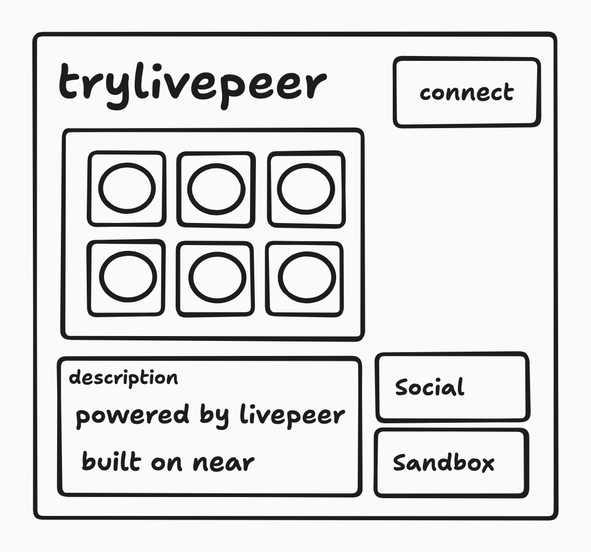

# trylivepeer.near

—> [near-bos-webcomponent](https://github.com/petersalomonsen/near-bos-webcomponent) with [livepeer](https://livepeer.org/) installed, deployed to [web4](https://web4.near.page/), in order to provide a sandbox for builders wanting to create decentralized video apps.



See it live: [trylivepeer.near.page](https://trylivepeer.near.page)

## Getting started

To run locally, install packages:

```bash
pnpm install
```

Then, run the command:

```bash
pnpm run dev
```

This will serve the widgets from `http://127.0.0.1:4040/` and start a local gateway.

## Usage

In the local gateway (localhost:3000), open `localhost:3000/trylivepeer.near/widget/index`,
then navigate to the sandbox.

The goal of this project is to expose the below components through the Near Social VM, so that these keywords may be used in Widgets.

### `Player`

https://docs.livepeer.org/sdks/react/migration/migration-4.x#player

Example code: https://docs.livepeer.org/sdks/react/Player

### `Broadcast`

https://docs.livepeer.org/sdks/react/migration/migration-4.x#broadcast

Example code: https://docs.livepeer.org/sdks/react/Broadcast


### TODO:
- [ ] Player Component
- [ ] Broadcast Component
- [ ] ICreate clone of SDK for VM.require module (@mattb.near) : livepeer-js : https://docs.livepeer.org/sdks/
- [ ] Ability to set default workspace